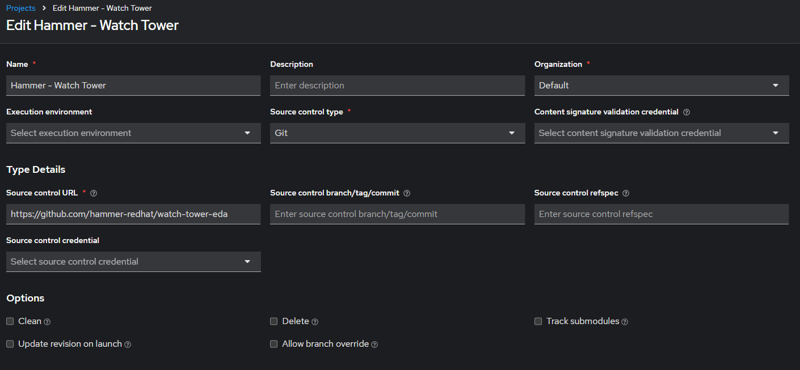
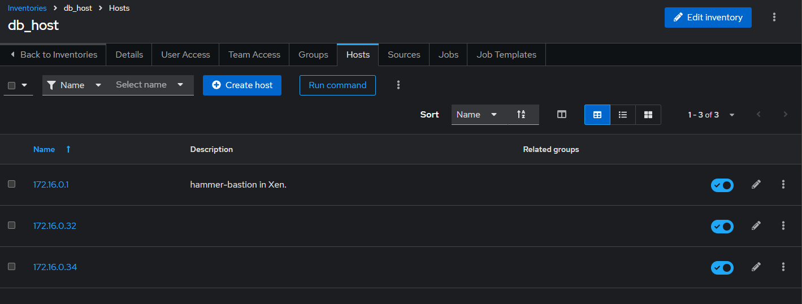
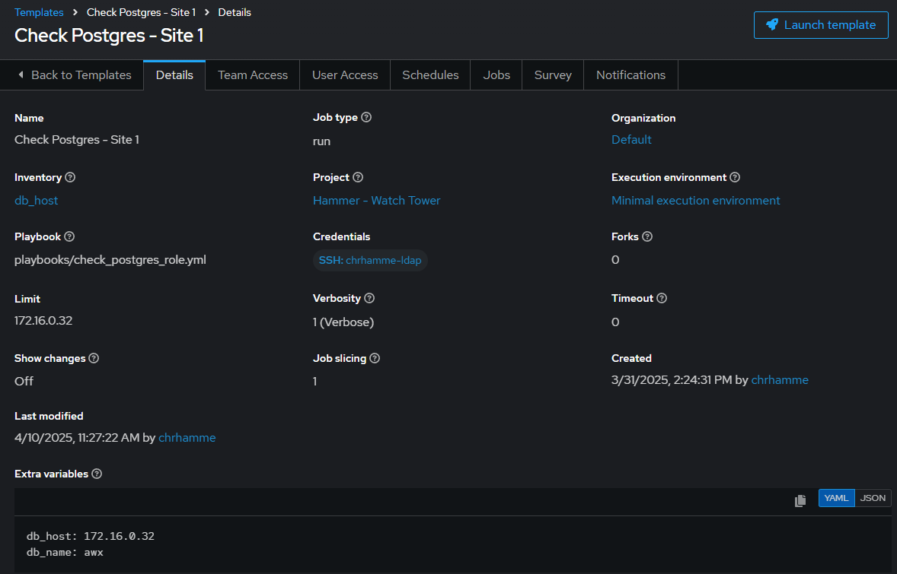
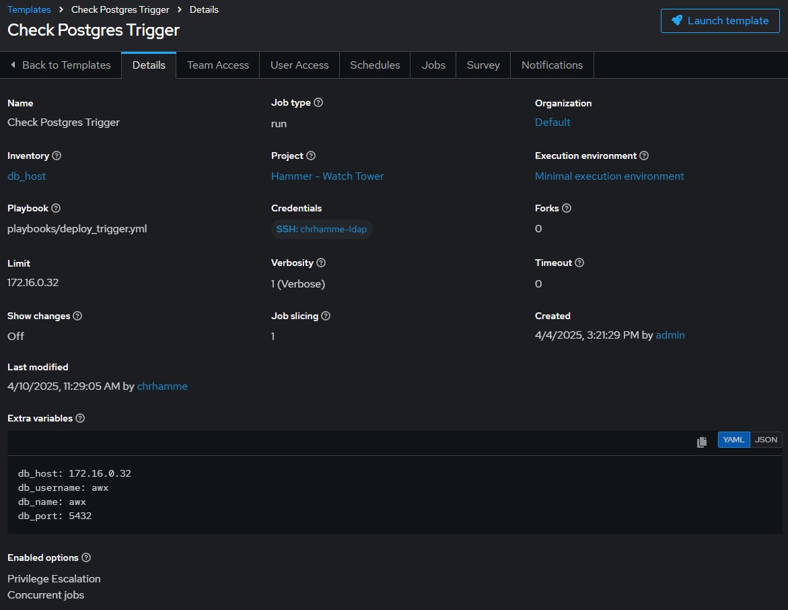
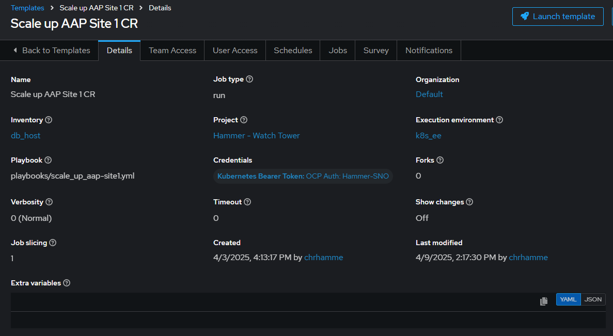

# Watch Tower EDA

Watch Tower EDA is a project designed to monitor and failover a multi-site Ansible Automation Platform deployment on two independent Openshift clusters.

## Table of Contents

- [Overview](#overview)
- [Features](#features)
- [Installation](#installation)
- [Usage](#usage)
- [Contributing](#contributing)
- [License](#license)

## Overview

Watch Tower EDA accomplishes automated failover by managing a multi-site AAP deployment using Ansible playbooks with scheduled runs. Additionally Event-Driven-Ansible is configured to listen and watch for events on the Postgres DB cluster deployed in a highly available architecture. 

## Features   
## Playbooks:
- Check PostgreSQL Database Role: This playbook runs a psql command to determine if the postgres instance is one of the following: _'Primary/Leader, Standby or offline'_.
- Deploy PostgreSQL Trigger: This playbook determines if the `pg_notify` trigger exists, if it doesn't it configures it by running the `files/queue.sql` script located in this repo. 
- Failover EDB: These playbooks were created to simplify triggering the database failover on the EnterpriseDB PostgreSQL cluster we deployed. It utilized the playbooks shipped with tpaexec and is located here - `/opt/EDB/TPA/architectures/M1/commands/switchover.yml`. You can ignore using these playbooks as they're used for demonstrating failover scenarios for this use case.
-  Scale up/down AAP: These playbooks use the `redhat.openshift.k8s` module to apply changes to AAP Custom Resources in Openshift. The playbooks use the following files in this repo:  
    - Scaling up:   
        - aap-cr-up-site1.yml  
        - aap-cr-up-site2.yml
    - Scaling down: 
        - aap-cr-down-site1.yml
        - aap-cr-down-site2.yml
    - These files change line 30 in the files from `replicas: 0` -> `replicas: 1` when scaling up and vice versa.  

## Rulebooks:
- There are two rulebooks preconfigured for you, one to monitor postgres per site. 
    - pg_monitor_rulebook_site1.yml
    - pg_monitor_rulebook_site2.yml
- Within these rulebooks the source is `ansible.eda.pg_listener`. This listens to events published by `pg_notify` commands run in the `check_postgres_role.yml` playbook. 
- After the sources in the rulebook you'll see that they each have two rules based on the `event.postgres_db_role` output generated by the `check_postgres_role.yml` playbook. These trigger the scale up/down functions based on if the condition is met. 

## Execution Environment:
- There is one execution environment that is required to be used that includes the `redhat.openshift` collection and that is included here and can be built using the following steps as an example. 
```
ansible-builder build -f execution_environment/k8s_ee.yml -t k8s_ee
podman images # grab the Image ID to then push to automation hub.
podman login aap.example.com
podman push <paste Image ID> aap.example.com/namespace_example/k8s_ee
```
## Workflow Diagram: 
.png>)

## Installation

To clone and use this project from CLI, follow these steps:

1. **Clone the repository:**

```bash
git clone https://github.com/hammer-redhat/watch-tower-eda.git
```
Navigate to the project directory:
```
cd watch-tower-eda
```
Install dependencies:
```
ansible-galaxy collection install -r requirements.yml
```

## Usage in Ansible Automation Platform:
To use Watch Tower EDA in AAP:  

1. Create a project in **AAP Controller and EDA** and sync both:

2. Create an inventory and populate it with Postgres cluster hosts, ensure they're enabled.

3. Credentials - You will need to create Openshift Token credentials in AAP to authenticate into Openshift and scale your CR's accordingly.

4. Setup the Check Postgres playbooks for Site 1 & Site 2. 

    - Note the extra vars specified that point to the `db_host: <site 1 db IP address>` as well as the `db_name: awx` that has the postgres trigger configured for pg_notify. 
5. After creating the job template, click on the schedule tab for the playbooks and create a schedule that runs the playbook every minute. 

6. Repeat steps 4 & 5 but for Site 2 this time. 
7. Next create the Check Postgres Trigger playbook:

    - Note the extra vars specified as well as the enabled options.
        - Priviledge Escalation
        - Concurrent Jobs
    - Additionally with DB replication you should only need to target the primary initially with this playbook. You can also use preference with scheduling this however often you'd like. 
8. Finally create the four job templates using the scale up/down playbooks for each site. This equals out to 2 job templates per site (up/down playbooks are separate) and 4 playbooks total across both sites. Note that for these playbooks you will need to use your Openshift API credential created earlier as well as the `k8s_ee` as an execution environment that has the `redhat.openshift` collection installed. 

Once complete you should have four playbooks:

9. With all of the playbooks configured you can now swap over to the `Automation Decisions - Event-Driven Ansible` tab on the left side of the screen to configure the following:
    - Decision Environment: A container that has the required dependencies and collections to run the ansible.eda collection. Luckily, our de-supported-rhelX images have this already. 
    - 